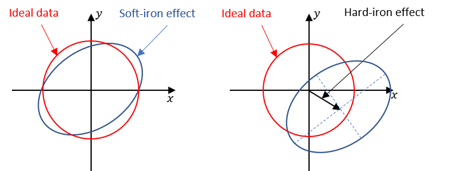
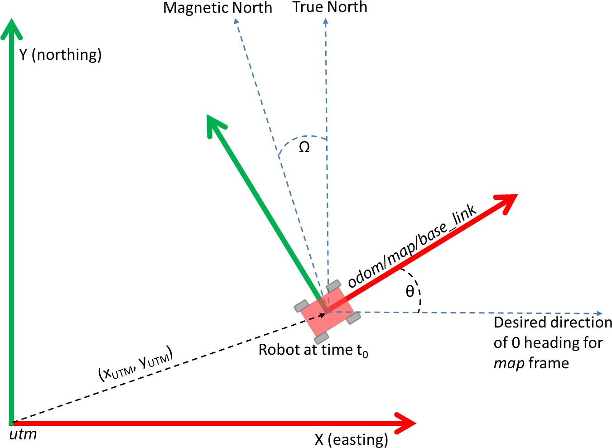
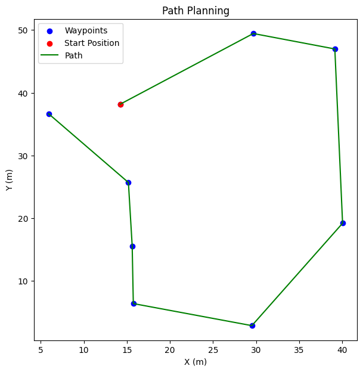
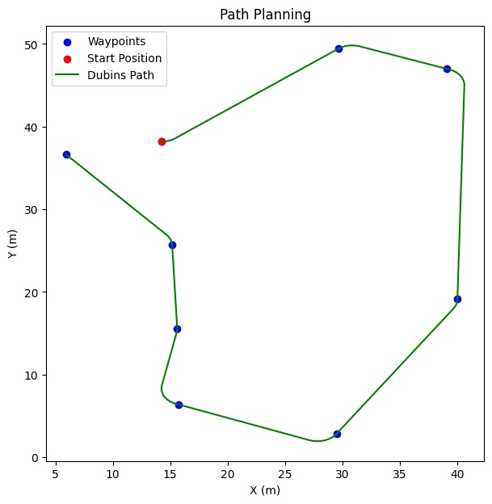

# GPS Waypoint Navigation


## Group Members
<table border="1">
  <tr>
    <th>Name</th>
    <th align="center">Task</th>
  </tr>
  <tr>
    <td>Zewdie Habtie</td>
    <td>
      <pre>
      - Calibration of Magnetometer sensor
      - Correcting the distortion in the magnetometer sensor readings
      - Debugging and testing
      </pre>
    </td>
  </tr>
  <tr>
    <td>Eliyas Kidanemariyam</td>
    <td>
    <pre>
      - Configuration of launch files
      - Prepare simulation environment
      - Implement latitude and longitude to cartesian points in robot frame
      </pre>
    </td>
  
  </tr>
  <tr colspan="2">
  <td> Both</td>
  <td> 
    <pre>
    - Implement GPS navigation node
    </pre>
  </td>
  </tr>
</table>
## Part 1 : 

### Task1: Calibration of Magnetometer sensor
For the GPS navigation to work correctly, initial robot orientation must be aligned with the global(earth's) coordinate frame ([IMU should read 0 for yaw when facing east](https://docs.ros.org/en/melodic/api/robot_localization/html/navsat_transform_node.html)). According to [REP 105](https://www.ros.org/reps/rep-0105.html), when using GPS for navigation, the robot's x-axis should point towards the east, and y-axis should point towrads the north.  

The reading from the Magnetometer sensor can be used to calibrate the robot's orientation. The magnetometer sensor provides the magnetic field vector in the robot's local coordinate frame. However, the magnetometer itself is distorted by magnetic field from the sensor circuit board, and the surounding environment.The two most common distortion are hard iron and soft iron distortion as shown in the following figure.
<p>
   &nbsp;&nbsp;
</p><br>

To correct these distortions, the magnetometer sensor readings can be calibrated using the following steps:
1. **Collect Data**: Collect data from the magnetometer sensor while rotating the robot in all possible directions. Figure-eight motion is a common method to collect data from the magnetometer sensor.
2. **Compute calibration coefficients**: Use the collected data to compute the calibration coefficients. The calibration coefficients are used to correct the distortions in the magnetometer sensor readings. Different tools such as [magcal](https://www.mathworks.com/help/nav/ref/magcal.html) can be used to compute the calibration coefficients.

The equation is:

$$ 
C = (D - b) \cdot A
$$
<br>
where `C` is the calibrated magnetometer sensor readings, `D` is the raw magnetometer sensor readings, `A` is the soft iron calibration matrix, and `b` is the hard iron calibration vector.

 2.1. **Soft Iron Calibration**: The soft iron calibration corrects the ellipsoidal distortion in the magnetometer sensor readings. The calibration coefficients are used to scale the magnetometer sensor readings along each axis. These coefficients are represented as a matrix(`A` in the above equation) and multiplied with the magnetometer readings.

 2.2. **Hard Iron Calibration**: The hard iron calibration corrects the offset in the magnetometer sensor readings. The calibration coefficients are used to shift the magnetometer sensor readings along each axis. This coefficents are represented as vector(`b` in the above equation) and added to the magnetometer readings. 

 #### Calibration results for both Pomona and Silvanus
  <p>
   &nbsp;&nbsp;
   &nbsp;&nbsp;
</p><br>

<table border="1">
  <tr>
    <th>Robot</th>
    <th align="center">A</th>
    <th align="center">b</th>
  </tr>
  <tr>
    <td>Pomona</td>
    <td>
      <pre>
      | 1  0  0 |
      | 0  1  0 |
      | 0  0  1 |
      </pre>
    </td>
    <td>
      <pre>
      | -0.1908 |      
      | -0.0518 |
      | -0.5559 |
      </pre>
    </td>
  </tr>
  <tr>
    <td>Silvanus</td>
    <td>
    <pre>
      | 0.8965  0.0139  0.1370 |
      | 0.0139  1.5075  0.3872 |
      | 0.1370  0.3872  0.8593 |
      </pre>
    </td>
    <td>
      <pre>
      | 0.0243  |       
      | -0.3730 |
      | -1.1995 |
      </pre>
    </td>
  </tr>
</table>

**Note:** <font color='lime'>These calibration coefficients can be used for the respective robots in future experiments. However, we recommend recalibrating the magnetometers in both robots with more data to improve the accuracy of the calibration coefficients. 
</font> <br>

### Task 2: Reading waypoints and Saving waypoints.
- We implement waypoint_manager to read waypoints from `geojson file` and save to `waypoints/lat_lon.txt` or write gps points manually in `waypoints/lat_lon.txt file`.

### Task 3: Transform to robot coordinate
- **calibration**: first we callibrate te robot to point east or get the rotation matrix with global east 
- **Anchor Point**: The robot's starting GPS position is assigned as the anchor point (reference point).
- **UTM transformation** : We implement function to  transforms geographic coordinates (latitude and longitude) of waypoints into a robot's local Cartesian coordinate using UTM (Universal Transverse Mercator) transformation frame (X, Y coordinates).

  &nbsp;&nbsp;


## Part 2: Efficient Waypoint Traversing Path Planning 
### Method 1 - Nearest Neighbor Algorithm with Dubins Path Constraints
To implement the nearest neighbor algorithm, we begin at robot position. From there, we find the closest unvisited waypoint and add it to the sequence. Then, we move to the next node and repeat the process of finding the nearest unvisited node until all nodes are included in the tour.To find the neareast unvisited node we use The `KDTree` class from `scipy.spatial` to find the k nearest neighbors of the current waypoint instead of searching the whole waypoint.

#### Summary of the Nearest Neighbor 

  1. **Start at a robot position**.
  2. **Find k neareast neighbors waypoints  to the current waypoint**.
  3. **Remove neareast waypoint with robot non holonomic constrain**:omit waypoints inside the turning radius  of the current waypoint** 
  4. **Calculate Dubins path to each selected waypoint.** 
  5. **Select waypoint with minimum dubins  path lenght.**
  6. **Add to Path and Repeat**: Add the nearest point to the path, mark it as visited, and move to this point. Repeat the process until all points are visited.**


### Method 2 : Using Traveling Salesman Problem (TSP) approximate Algorithm
This method uses the `NetworkX` library to build a weighted graph between waypoints, allowing for efficient path planning. It then calculates an approximate solution to the Traveling Salesman Problem (TSP) using this graph. Finally, it utilizes the TSP solution to compute new Dubins paths between waypoints, ensuring adherence to non-holonomic constraints.

#### steps
 
  1. **Add Nodes**: Add a node to the graph for each waypoint, including the robot's starting position. 

  2. **Add Edges**: Adds edges to the graph with the calculated path length as the weight. instead of create a graph with the whole node i use the `KD-tree` for efficient neighbor searching.

  3. **Find an approximate solution to the Traveling Salesman Problem (TSP) starting from a start waypoint.**:uses the NetworkX approximation algorithm to solve the TSP for the graph 
  
  4. **Calculate dubins path**: calculate the dubins path from the approximate tps path , omit points that does not adhere the non holonomic constrain of te robot. 

  The following figure shows optimaized dubins path bettewen waypoints

  <div style="display: flex; justify-content: center;">
    <div style="flex: 1; margin-right: 10px;">
        
        <p style="text-align: center;"> 8 sample points </p>
    </div>
    <div style="flex: 1; margin-right: 10px;">
        
        <p style="text-align: center;"> 8 sample points </p>
    </div>
 
</div>

### Obstacle Avoidance Planner and controller  
   
   #### Method1 : Custome Planner

   1. **RRT_Planner** : This takes the start and the next waypoint and gives us a efficient  path between the two waypoints considering the obstacle(uses the `StateValidityChecker` to check for state of position and path). 
   2. **State_Validity_Checker**: This class, `StateValidityChecker`, is responsible for checking the validity of individual positions and paths (sequences of positions) with respect to obstacel list.
   3. **Move Controller**:publishes velocity to navigate the robot to next point.

   #### Method2:  MoveBase ros package Planner 
   1. A* star 
   2. DWA


### How to start navigation
- Use the following commands to start the navigation:
```bash
sudo ssh agilex@192.168.1.102                                # ssh into pomona robot
source ~/zedeli_ws/devel/setup.bash                          # source the workspace

sudo ip link set can0 up type can bitrate 500000             # Start the can0 interface
roslaunch scout_bringup scout_minimal.launch                 # Start the minimal launch file

# In a new terminal
source ~/zedeli_ws/devel/setup.bash                          # source the workspace
roslaunch scout_bringup sensors.launch                       # Spawns lidar, gnss

# In a new terminal run
source ~/zedeli_ws/devel/setup.bash                          # source the workspace
rosrun scout_robot__2dnav imu_vis.py                         # To face robot to the east, stop node once robot faces east

# In a new terminal run
source ~/zedeli_ws/devel/setup.bash                          # source the workspace
rosrun scout_robot__2dnav gps_navigation_node.py             # Start the navigation node
```
**Note:** Before running the above commands, make sure to save GPS waypoints in `src/scout_robot_project/scout_robot__2dnav/waypoints/lat_lon.txt` file.
